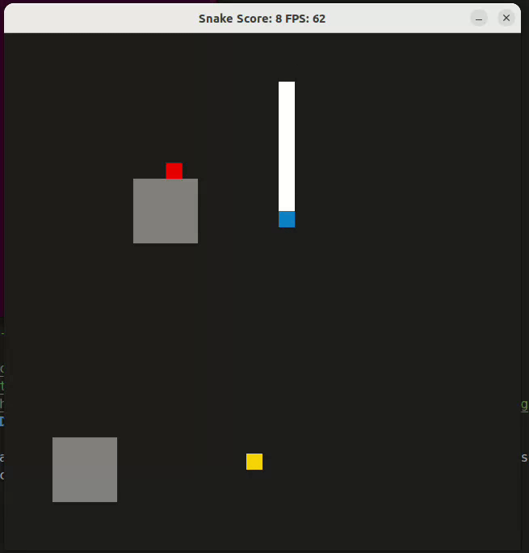

# Snake Game (C++ SDL2)

This Snake game is a C++ application built with SDL2 for graphics. It includes a menu system, difficulty levels, concurrent obstacle generation, persistent game history, and visual feedback for game state.


---

## Table of Contents

- [Dependencies](#dependencies)
- [Build Instructions](#build-instructions)
- [How to Play](#how-to-play)
- [New Features](#new-features)
- [Rubric Points Addressed](#rubric-points-addressed)
- [License](#license)

---

## Dependencies for Running Locally
* cmake >= 3.7
  * All OSes: [click here for installation instructions](https://cmake.org/install/)
* make >= 4.1 (Linux, Mac), 3.81 (Windows)
  * Linux: make is installed by default on most Linux distros
  * Mac: [install Xcode command line tools to get make](https://developer.apple.com/xcode/features/)
  * Windows: [Click here for installation instructions](http://gnuwin32.sourceforge.net/packages/make.htm)
* SDL2 >= 2.0
  * All installation instructions can be found [here](https://wiki.libsdl.org/Installation)
  >Note that for Linux, an `apt` or `apt-get` installation is preferred to building from source. 
* gcc/g++ >= 5.4
  * Linux: gcc / g++ is installed by default on most Linux distros
  * Mac: same deal as make - [install Xcode command line tools](https://developer.apple.com/xcode/features/)
  * Windows: recommend using [MinGW](http://www.mingw.org/)

---

## Build Instructions

1. **Clone this repo:**
```
git clone https://github.com/Subramanyanataraj/Snake-Game.git
```
2. **Create a build directory:**
```
mkdir build && cd build
```

3. **Compile:**
```
cmake .. && make

```
4. **Run the game:**
```
./SnakeGame
```

---

## How to Play

- **Start the game:** Use the menu to select new game, options, or difficulty.
- **Controls:** Arrow keys to move the snake.
- **Difficulty:** Choose between easy (no obstacles) and difficult (obstacles generated with multithreading).
- **Game History:** Scores are saved to `data/GameHistory.txt`.
- **Special Food:** Collect unknown food for bonus (Red color) points or risk poisoning, and if it is poison, you have to eat medicine in 10 seconds otherwise snake dies.

---

## New Features

- **Menu System:** Select new game, options, or difficulty.
- **Difficulty Levels:** Easy (no obstacles) and Difficult (obstacles generated with multithreading).
- **Obstacles:** 4x4 blocks that kill the snake on collision. Generated only in difficult mode.
- **Concurrent Obstacle Generation:** Obstacles are generated in parallel using `std::thread` and protected by a mutex.
- **Persistent Game History:** Player names, scores, and snake sizes are saved to `data/GameHistory.txt`.
- **Visual Feedback:** Snake head turns red when dead, even if overlapping with obstacles.

---

## Rubric Points Addressed

| Rubric Point                | How it is Addressed                                                                 | Where in Code (with functions/methods, add line numbers if needed) |
|-----------------------------|-------------------------------------------------------------------------------------|--------------------------------------------------------------------|
| **README**                  | This README includes build instructions, dependencies, new features, and rubric mapping. | `README.md`                                                        |
| **Compiling and Testing**   | The code compiles and runs locally using cmake and make.                           | `CMakeLists.txt`, `build/`                                         |
| **Loops, Functions, I/O**   | Demonstrates C++ functions, control structures, file I/O, and user input.           | `main.cpp` (main loop, user input),<br>`game.cpp` (game logic),<br>`menu.cpp` (menu logic),<br>`player.cpp` (`Player::SaveToFile()`--line number 19  , `Player::PrintGameHistory()`) --line number 47 |
| **Object-Oriented Programming** | Uses classes with appropriate access specifiers, encapsulation, and member initialization lists. | `game.h`/`game.cpp` (Game class, methods),<br>`snake.h`/`snake.cpp` (Snake class, methods),<br>`obstacle.h`/`obstacle.cpp` (Obstacle class, methods),<br>`menu.h`/`menu.cpp` (Menu class, methods),<br>`player.h`/`player.cpp` (Player class, methods) |
| **Memory Management**       | Uses smart pointers (`std::unique_ptr`) , references, and RAII.                      | `main.cpp` (`std::unique_ptr<Player>`)--line number 14 (player.cpp) ,<br>Function signatures using references (e.g., `void SaveToFile(const std::string&, int&, int&)` --line number 47  in `player.cpp`) |
| **Concurrency**             | Uses multithreading for obstacle generation and a mutex for thread safety.          | `game.cpp` (`SetupObstacles()` --line number - 33, `obstacles_mutex` -- line number-38) |

---
## Code structure
```
├── CMakeLists.txt
├── README.md
├── snake_game.gif
├── data/
│ └── GameHistory.txt
└── src/
├── controller.cpp
├── controller.h
├── game.cpp
├── game.h
├── main.cpp
├── menu.cpp
├── menu.h
├── obstacle.cpp
├── obstacle.h
├── player.cpp
├── player.h
├── renderer.cpp
├── renderer.h
└── snake.h
```

## CC Attribution-ShareAlike 4.0 International


Shield: [![CC BY-SA 4.0][cc-by-sa-shield]][cc-by-sa]

This work is licensed under a
[Creative Commons Attribution-ShareAlike 4.0 International License][cc-by-sa].

[![CC BY-SA 4.0][cc-by-sa-image]][cc-by-sa]

[cc-by-sa]: http://creativecommons.org/licenses/by-sa/4.0/
[cc-by-sa-image]: https://licensebuttons.net/l/by-sa/4.0/88x31.png
[cc-by-sa-shield]: https://img.shields.io/badge/License-CC%20BY--SA%204.0-lightgrey.svg -->


